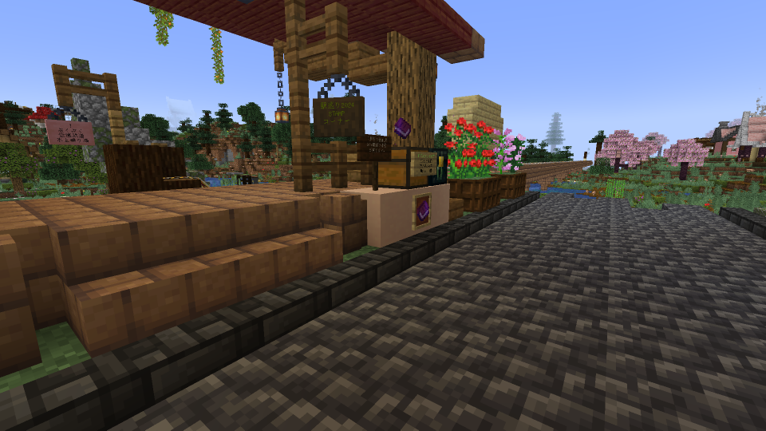
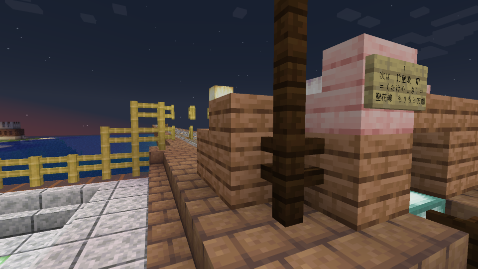
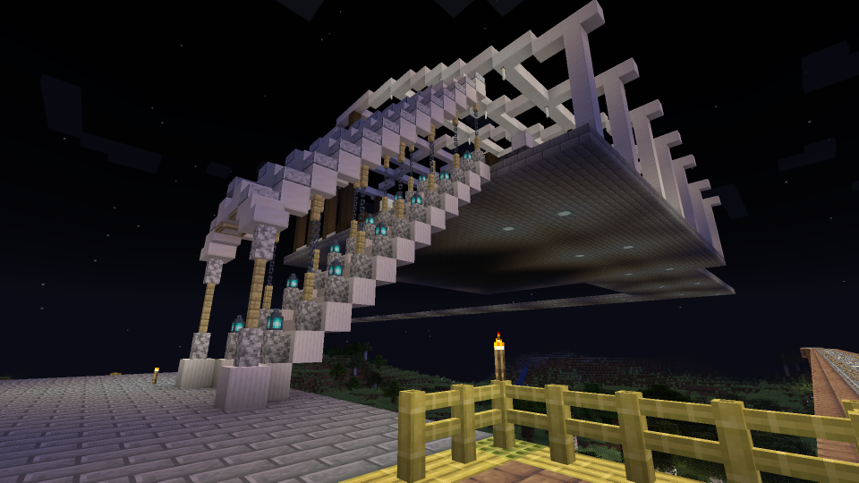
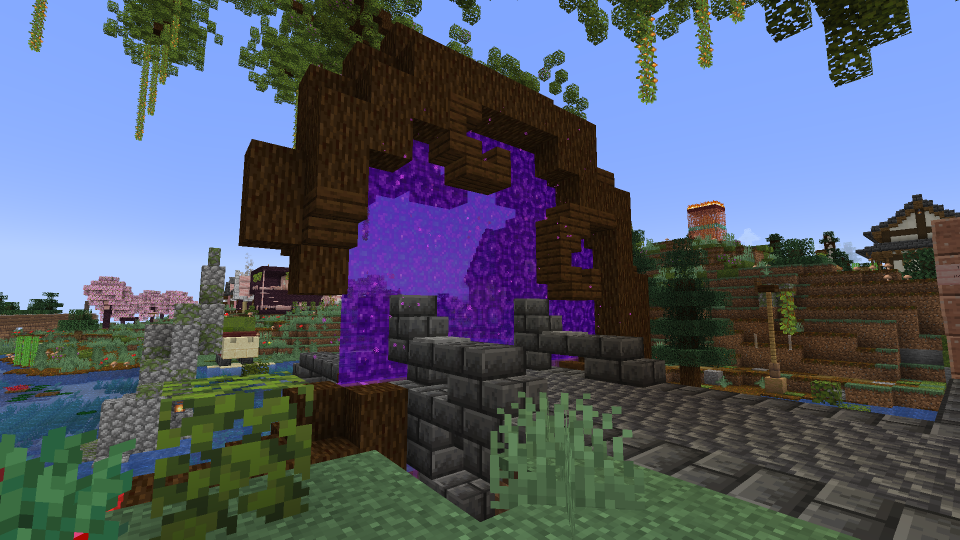
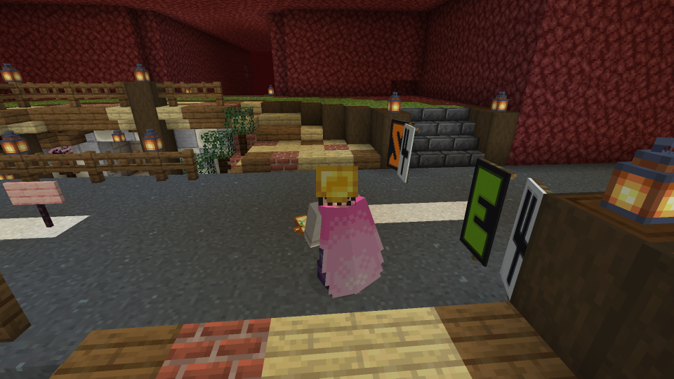
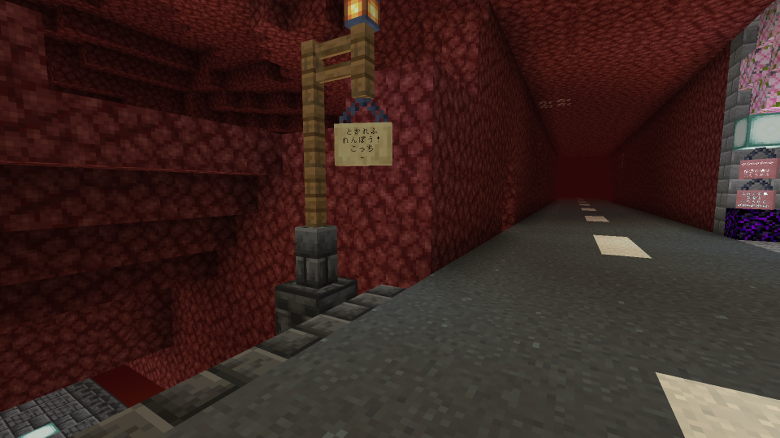

(全景画像)

## トカレフ連邦とは

もりのパーティの住民であるトカレフ氏(\_Tokarev)によって 2024 年辺りに設立されたコミュニティ団体です

<dl>
  <dt>何をする団体なの？</dt>
  <dd>基本的に所有している街の開拓、自分の家の建設などです！</dd>
  <dt>どうすれば入れますか？</dt>
  <dd>メンバーの偉い人に相談してみましょう！（下記に記載しています）</dd>
  <dt></dt>
</dl>

## 主な建築

### 時計台駅

### 自動畑

### 共有倉庫

### 銀行

### ジブリパーク

## 主な住人

<div class="user">
  
  _Tokarev
</div>

トカレフ連邦書記長

<div class="user">
  
  Asasimo
</div>

数多くの近代建築を主導

<div class="user">
  
  NatsumikanNa
</div>

ジブリ関連の建築

<div class="user">
  
  ShiroqRi
</div>

疾風のごとく巨大建築をこなす

<div class="user">
  
  Tsubumame1
</div>

カジノの仕掛けを構築

<div class="user">
  
  narumincho
</div>

謎解き建築を計画中

## 来訪する方法

```
<iframe width="100%" height="256px" src="https://seikatsumain.map.morino.party/#minecraft_overworld;flat;3449,64,-2029;2">
```

### 景観と安全性重視

スポーン地点 星樹から北に伸びる路線「聖花線」に乗ります



花めいろ, 水時計, 花木郡, 平林をそのまま通過して, 「牛嶋」で他の路線に乗り換えず北の「聖花線」を進みます



竹屋敷, 岩間, そして「青原」に着いたら白い階段を登った先の路線に乗り換えます



右にエルドランド城を見て着いた駅で到着です

ようこそ, トカレフ連邦へ

### 速度重視

スポーン地点のネザーゲートからネザーに行きます



X-方向 (西) に進み X=500 の交差点(S4 E4)まで進み, Z-方向 (北) に進みます



Z=-250 のところで「とかれふれんぽう! こっち ←」と書かれた看板があるので, 看板の方向に少し進むとトカレフ連邦に出られるネザーゲートがあります



## 同志になる方法

〜に連絡ください

<style>
  .user {
    display: flex;
    align-items: center;
    gap: 8px;
  }

  .skin {
    width: 32px;
    height: 32px;
    image-rendering: pixelated;
  }
</style>
